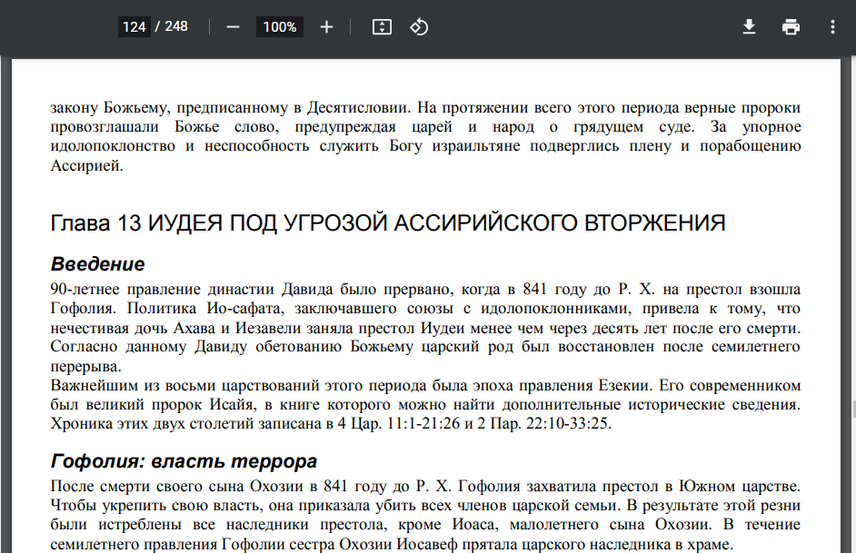

## Схема разделенного царства ветхого завета
Данная схема отображает на временной линии даты крупных событий, жизни царей и пророков.
Кликнув по имени, можно узнать об исторической личности подробнее в модальном окне.
## Текущее состояние проекта

На момент 2022г схема содержит:
1) Биография каждого царя или пророка из книг Шульца, Егорова или Шевцова;
2) Система ссылок на pdf книги (кликаете на ссылку в браузере на компьютере - открывается pdf на нужной странице)
3) Система якорей для переходам к сноске или обратно (у пророков Исаиа и Иеремии);
4) Вспомогательная панель, чтобы перемещаться по странице без использования клавиатуры.

## Доработка схемы
В случае доработки схемы используйте информацию ниже.
В качестве редактора можете использовать:
- Sublime Text 3;
- VS code;
- Intelij IDEA или PHPStorm;
- Notepad++ и проч.

Сама схема является всего одним файлом `html.html`
## 1. Доработка биографии
Любая биография обернута в блок с классом `popup-text-block`. Используйте поиск (CTRL+F), чтобы найти такие блоки.

Если биографию, которую вы хотите заменить, ранее была в Microsoft Word документе, используйте https://word-to-html.ru/ или подобные сайты для преобразования документа в html.

Если вы хотите сдвинуть какую либо точку, вы можете поиграться со значениеми top|left|right|bootom в объявлении css-классов типа `.time-dot`

## 2. Использование системы ссылок на pdf книги
Открыв любую биографию

Можно перейти по ссылке, попав на ту часть книги, откуда взята биография

Инструкция добавления новой книги в документ:
1. Выложите pdf в открытый доступ, чтобы по ссылке его можно было скачать;
2. Найдите уже существующие функции `createLinks("id", "name", "link");`, рядом с ними вызовите еще одну, где:
   - id - придуманный вами уникальный идентификатор книги (таких id в документе больше быть не должно);
   - name - имя, которое будет видеть пользователь схемы;
   - link - ссылка на ваш pdf.
3. В часть биографии, где хотите вставить ссылку, добавьте тег такого формата:
`
 
`,
   где id - тот самый идентификатор, на который вы привязали ссылку, а value - число либо 2 числа через черточку, которые обозначают страницу, на которой будет открываться pdf документ (если это 2 числа, ссылка откроет страницу первого числа).
## 3. Использование системы якорей для переходам к сноске или обратно
Открыв биографию, вы можете перейти к сноске

и уже ознакомившись со сноской, вернуться в то место документа, где вы остановились

Инструкция по добавлению сносок:
1. Придумайте уникальное имя класса (в данном примере - className), которое будет использоваться для сносок именно в ЭТОЙ биографии;
2. Рядом с другими `createFootnote("className");` функциями объявите свою;
3. Сразу же, как только заканчивается текст биографии (но не заканчивается закрывающий div), добавьте блок, в котором будут храниться все ваши сноски

`<footer> <!-- Тут будут ваши сноски --> </footer>`

4. Добавьте в то место, где вы хотите ссылку на сноску, данный тег
`` , а в footer напишите сам текст сноски, и поставьте этот же тег перед ним.  
   
В итоге, структура документа должна получиться такой:

		
 какой-то текст статьи  

		...
		<footer>
		...
			
  Какой-то текст сноски 

		...
		</footer

## 4. Изменение вспомогательной панели
Данная панель выглядит так в свернутом виде 

И вот так в развернутом 

Скорость движения схемы можно изменить, поменяв входные параметры в местах вызова функций `scrolling`

Поменять стили по усмотрению можно в сss классах `.sidebar` , `.open` и `.icon`

По всем вопросам пишите на почту `VanekMRZ@yandex.ru`

C Уважением, Мороз Иван, Карпов Федор, Лысенко Евений 
